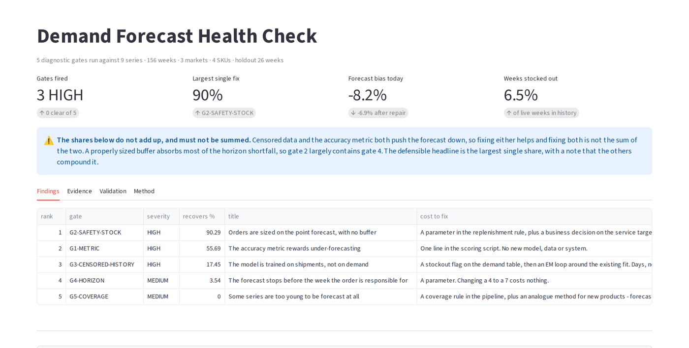

## Debadrita Choudhury

Regional head of data science and analytics — ~20 years across BFSI, CPG,
retail and insurance, leading teams of 80+ across multiple countries.

I still build. The four applications below are running right now, and you
can open any of them.

---

<table>
<tr>
<td width="50%">

**Luxury Clienteling Co-Pilot** 
Ranks which clients an advisor should contact today, on which channel, with a drafted message — and holds back the ones it shouldn't, with the reason shown.  
`15 scored` · `12 surfaced` · `3 held back` · rebuilds itself every morning

**[Open the brief](https://adrita333.github.io/luxury-copilot/)** · [Code](https://github.com/Adrita333/luxury-copilot)

</td>
<td width="50%">

**Retail Invoice & Trade-Claim Agent** 
Reads retailer deduction claims, checks each against the governing supply contract, and returns a verdict with the clause it relied on.  
`480 claims` · `73% auto-cleared` · `US$29,725 leakage found` · zero incorrect rejections

**[Open the app](https://retail-invoice-agent.streamlit.app/)** · [Code](https://github.com/Adrita333/retail-invoice-agent)

</td>
</tr>
<tr>
<td width="50%">

**Customer Enquiry Triage Agent** 
Classifies and answers inbound enquiries in five languages, escalating anything it cannot substantiate against the approved answer library.  
`900 enquiries` · `63% not in English` · `44% auto-answered` · 100% recall on health escalations

**[Open the app](https://customer-enquiry-agent.streamlit.app/)** · [Code](https://github.com/Adrita333/Customer-enquiry-agent)

</td>
<td width="50%">

**Demand Forecast Health Check** 
Runs five diagnostic gates over a demand history and ranks *why* the forecast is failing, by recoverable value — with tests built to disprove its own findings.  
`9 series` · `5 gates` · `largest single fix recovers 90%` · 4 validation tests

**[Open the app](https://demand-forecast-agent.streamlit.app/)** · [Code](https://github.com/Adrita333/demand-forecast-agent)

</td>
</tr>
</table>

*The three Streamlit apps are hosted free; if one shows a "wake app" button, give it about 30 seconds.*

---

### How they are built

The same three-stage shape each time: **run**, **store**, **ship**. The pipeline
scores everything once and writes it down; the interface only reads. Nothing is
computed at display time, so the number on screen is the number that was measured.

- **The answer key is quarantined.** Only the evaluation stage may read it. Nothing
  that produces a verdict can see it, which is what makes a scorecard a measurement
  rather than a restatement.
- **Every output is citable.** A verdict with no clause behind it is held, not sent.
  An answer not in the approved library does not go out.
- **What was refused is shown.** The clients not contacted, the claims held for
  review, the series too young to forecast — all visible, with the reason. Most
  systems only show what they decided to do.
- **The findings can fail.** The forecasting agent ships tests designed to disprove
  its own conclusions, and reports when one does.

All four run on synthetic data generated from a fixed seed, so every figure above
reproduces exactly. The faults in the data are ones I built in deliberately. On real
data the levels differ — what transfers is the method.

---

I'm always glad to talk about building and running analytics functions, and about
what AI actually changes inside an operating process — as opposed to what it is
said to change.

📧 [dchoudhury.oct@gmail.com](mailto:dchoudhury.oct@gmail.com) · 💼 [LinkedIn](https://www.linkedin.com/in/debadrita/)

© 2026 Debadrita Choudhury. Published for evaluation, not licensed for reuse.
